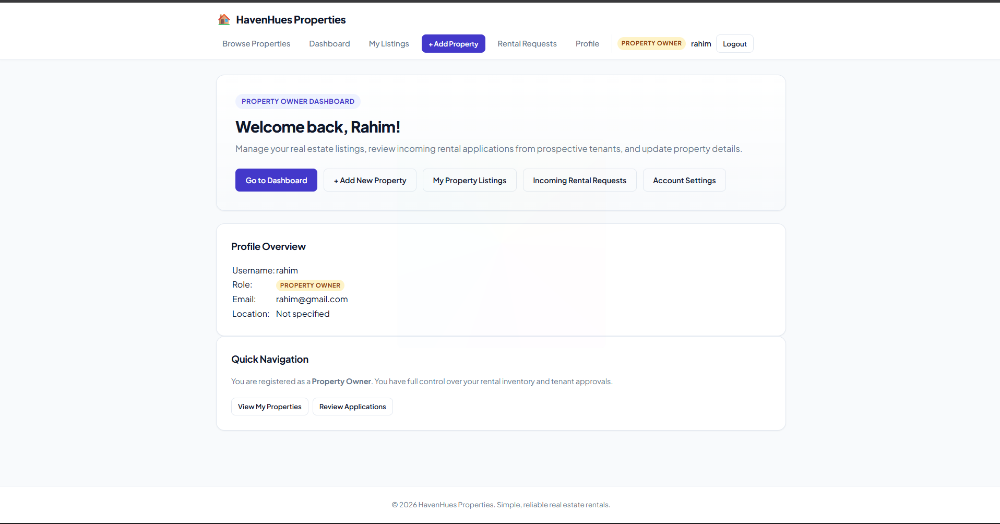
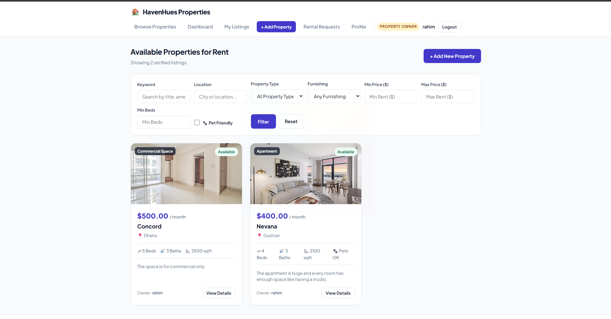
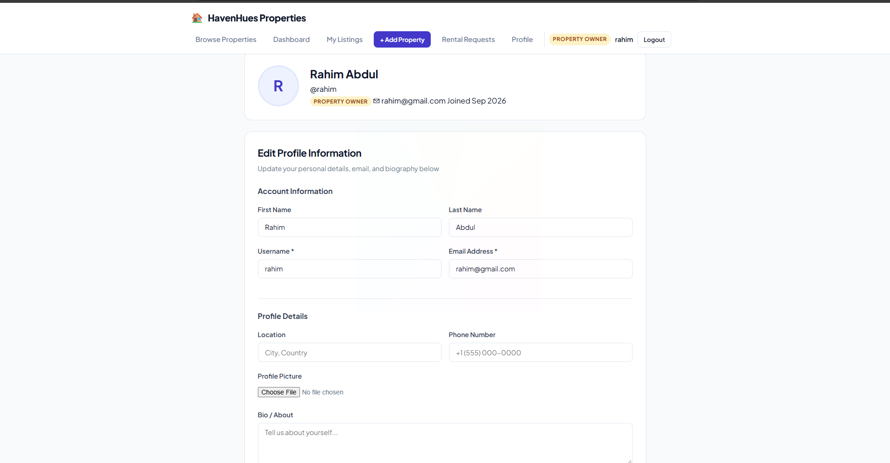
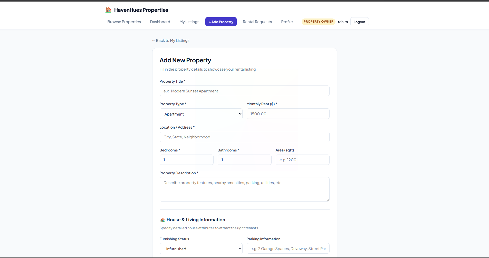
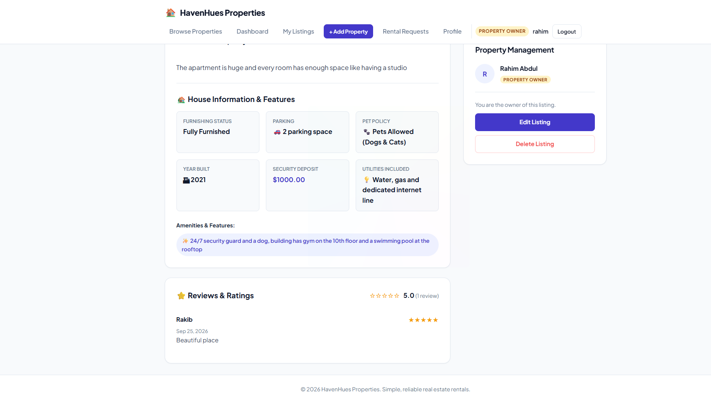
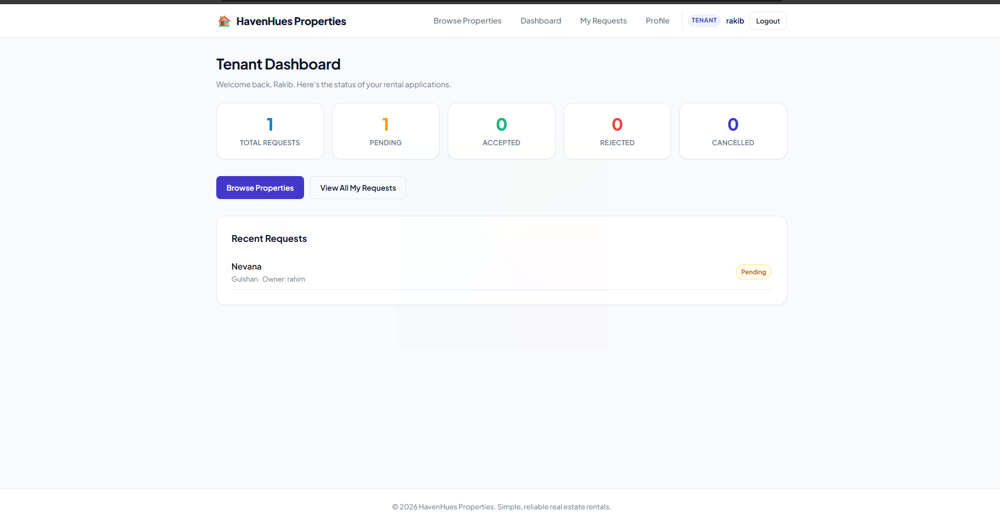
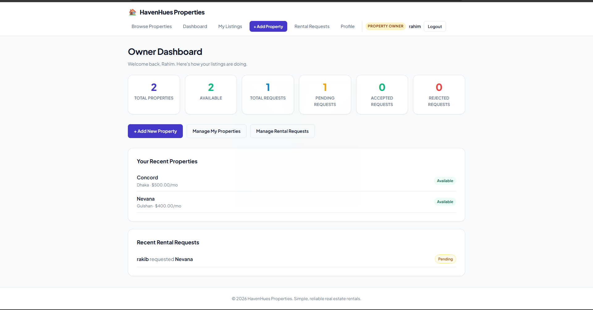
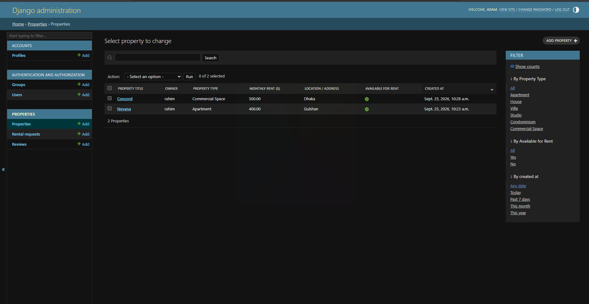

# HavenHues Properties — Property Rental & Management System

A Django-based web application where **Property Owners** can list properties for rent and
**Tenants** can browse listings and send rental requests. Built to demonstrate Django CRUD,
Forms, Templates, Authentication, Middleware, Model Relationships, and Role-Based Permissions.

## Screenshots

### Homepage


### Browse listings


### Profile


### Add Property Page


### Property Review


### Tenant Dashboard


### Owner Dashboard


### Django Admin Panel


## Features

### Authentication
- Registration (choose account role: Property Owner or Tenant), login, logout
- Profile view & update (bio, location, phone, avatar)
- Role stored on a `Profile` model (one-to-one with Django's built-in `User`)

### Property Management (Owner)
- Full CRUD on property listings (title, description, type, location, monthly rent,
  bedrooms, bathrooms, image, availability, plus extra fields like furnishing status,
  parking, pet policy, deposit, amenities)
- Owners can only edit/delete their **own** properties (enforced at the queryset level)

### Property Listing & Search (everyone)
- Public listing page with search by keyword and location
- Filters: property type, min/max rent, bedrooms, furnished status, pet-friendly

### Rental Request System (Tenant)
- Send a rental request (with move-in date, lease duration, message) on any available property
- View all of your own requests and their status
- Cancel a request while it is still **Pending**
- Business rules enforced in the view layer:
  - Only logged-in users can send requests
  - A tenant cannot request their own property
  - Only the owning Property Owner can accept/reject a request
  - A tenant cannot have two pending/accepted requests for the same property

### Owner Dashboard
`/owner/dashboard/` — total properties, available properties, total/pending/accepted/rejected
rental requests, plus quick links to manage listings and incoming requests.

### Tenant Dashboard
`/tenant/dashboard/` — total/pending/accepted/rejected/cancelled requests, plus quick links
to browse properties and manage requests.

### Reviews & Ratings
- A tenant may leave a 1–5 star rating + comment on a property **only after** one of their
  rental requests for it has been accepted
- A tenant can review a given property only once
- Reviews and the average rating are displayed on the property detail page

### Middleware
`core/middleware.py` defines `RoleAccessMiddleware`, a custom middleware that enforces
role-based access at the request layer (in addition to the view-level `@owner_required` /
`@tenant_required` decorators in `accounts/decorators.py`). It blocks Tenant accounts from
reaching any `/owner/...` URL and Property Owner accounts from reaching tenant-only areas
(`/requests/...`, `/tenant/...`), redirecting with a flash message.

### Django Admin
Users, Profiles, Properties, Rental Requests, and Reviews are all registered with useful
`list_display`, `list_filter`, and `search_fields` configuration.

## Tech Stack
- Django 6.1
- SQLite (default dev database)
- Pillow (image uploads)
- Server-rendered Django templates + hand-written CSS (no frontend framework/JS required)

## Project Structure
```
core/                   # Project settings, root urls, custom middleware
accounts/               # Auth, Profile model, decorators, base template, home page
properties/             # Property, RentalRequest, Review models, views, forms, templates
media/                  # Uploaded property images & avatars (not committed)
```

## Getting Started (Clone & Run on Your Own Computer)

Anyone can pull down this project and get it running locally with the steps below.
You'll need **Python 3.11+** and **git** installed first.

```bash
# 1. Clone the repository
git clone https://github.com/adam-61/Property-Rental-Management-System
cd django-rental-property

# 2. Create and activate a virtual environment
python -m venv venv
source venv/bin/activate      # Windows: venv\Scripts\activate

# 3. Install dependencies
pip install -r requirements.txt

# 5. Apply database migrations
python manage.py migrate

# 6. Create an admin account (for the Django Admin panel)
python manage.py createsuperuser

# 7. Run the development server
python manage.py runserver
```

Then open your browser to:
- **App:** `http://127.0.0.1:8000/`
- **Admin panel:** `http://127.0.0.1:8000/admin/` (log in with the superuser you just created)

To stop the server, press `Ctrl+C` in the terminal. To leave the virtual environment,
run `deactivate`.

## Roles at a Glance

| Action                          | Tenant | Property Owner |
|----------------------------------|:------:|:---------------:|
| Browse & search properties       | ✅     | ✅               |
| Add / edit / delete a property   | ❌     | ✅ (own only)    |
| Send a rental request            | ✅     | ❌               |
| Cancel a pending request         | ✅     | ❌               |
| Accept / reject a request        | ❌     | ✅ (own only)    |
| Leave a review                   | ✅ (after acceptance) | ❌ |

## Configuration & Secrets
`core/settings.py` reads `SECRET_KEY`, `DEBUG`, and `ALLOWED_HOSTS` from environment
variables (via `python-dotenv` + a local `.env` file), instead of hardcoding them:

- `.env` — your real local values. **Never commit this** (already in `.gitignore`).
- `.env.example` — a safe template showing which variables to set, committed to the repo.
- If `.env` is missing entirely, a clearly-labeled insecure fallback key is used so the
  app still runs locally — this fallback must never be relied on outside development.

No `.env` file, API keys, or credentials are included in version control.
